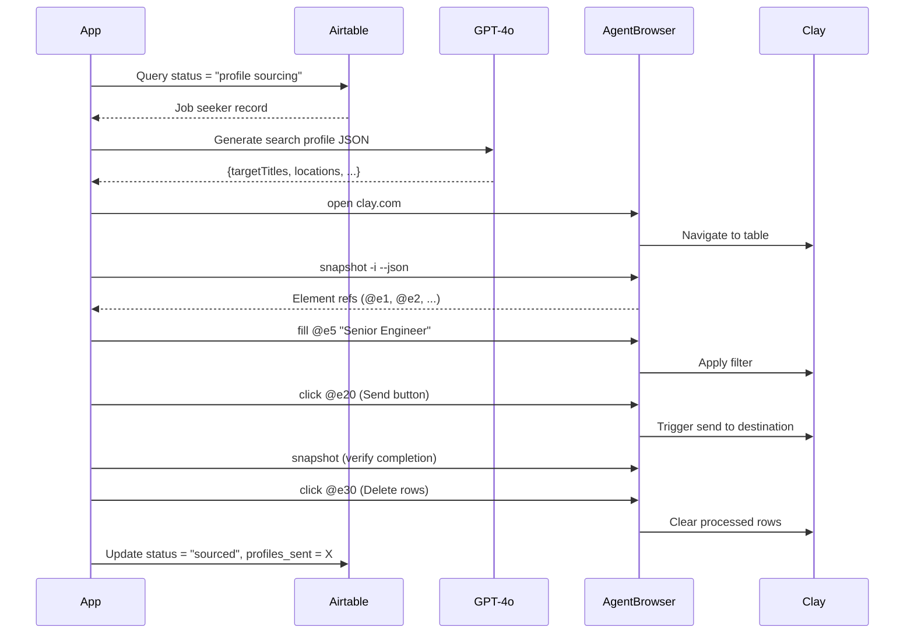

# PRD: Job Seeker Similar-Profile Sourcing Agent (Airtable + Clay + Agent Browser)

**Version:** 2.0  
**Date:** January 28, 2026  
**Status:** Updated with Cole-style Agent Browser Implementation Details

---

## 0. Implementation References (for the Agent)

When implementing this PRD, the agent **must** review and align with these references:

| Reference | Location | Purpose |
|-----------|----------|---------|
| Vercel Agent Browser CLI | `https://github.com/vercel-labs/agent-browser` | Install, CLI usage, commands |
| Cole Medin's Video | `https://www.youtube.com/watch?v=7aEQnTsI6zs` (5:05–10:30) | Workflow + Skill wiring |
| Local Testing Guide | `execution/local_testing_guide.md` | Docker + Agent Browser + OpenAI setup |
| Agent Browser Skill | `skills/agent-browser/SKILL.md` (to be created) | CLI command reference for the agent |

> [!IMPORTANT]
> The agent should read these files/URLs **before** changing the implementation plan. All browser automation must use `agent-browser` CLI commands, **not** raw Playwright scripts.

---

## 1. Goal and Scope

Build a **cloud-hosted AI agent** that:

1. Reads **job seeker** records from Airtable where status = `✨ Sourcing Profiles`.
2. Uses **OpenAI GPT-4o** to generate a structured "search profile" from each job seeker's data.
3. Uses **Vercel Agent Browser CLI** (Cole-style Skill approach) to drive Clay's web UI like a human.
4. Uses Clay's pre-configured table "send" destinations to deliver profiles to downstream systems.
5. Clears processed rows from the Clay table after sending.
6. Updates the job seeker's Airtable record to reflect completion and result status.

> [!NOTE]
> No n8n or external orchestrator is involved. The application is self-contained and runs on a Hostinger VPS using OpenAI GPT-4o and Vercel Agent Browser inside Docker.

---

## 2. Users and Main Scenario

**Primary User:** Recruiter / Operator who:
- Maintains job seeker data in Airtable.
- Maintains a Clay workspace/table configured with destinations to send selected rows to a downstream system (CRM, outreach, webhooks, etc.).

**Main Scenario:**

1. Recruiter adds or updates a job seeker in Airtable and sets status to `✨ Sourcing Profiles`.
2. The application poll on the airtable base at a regular interval and processes all job seekers in `✨ Sourcing Profiles` status.
3. For each job seeker, the application drives the Clay table to find and send similar profiles.
4. When done, the job seeker record status is updated in Airtable with a new status of `✅ Ready to Launch`

---

## 3. System Architecture

### 3.1 High-Level Overview

```
┌─────────────────┐     ┌──────────────────────┐     ┌─────────────────┐
│   Airtable      │     │  Hostinger VPS       │     │    Clay.com     │
│   JobSeekers    │────▶│  Docker Container    │────▶│  People Search  │
│   Table         │     │  (Python + Agent     │     │  Interface      │
│                 │◀────│   Browser CLI)       │◀────│                 │
└─────────────────┘     └──────────────────────┘     └─────────────────┘
                               │
                               ▼
                        ┌──────────────────┐
                        │  OpenAI API      │
                        │  GPT-4o          │
                        └──────────────────┘
```

### 3.2 Runtime Environment

- **Runtime**: Hostinger VPS (Docker on bare metal Ubuntu 24.04).
- **Container**: Single Docker image containing:
  - Application code (Python).
  - OpenAI GPT-4o client.
  - **Vercel Agent Browser CLI** installed globally.
  - System packages required by Playwright/Agent Browser.

### 3.3 Docker Configuration

From `execution/local_testing_guide.md`:

```dockerfile
# Base image with Playwright browsers pre-installed
FROM mcr.microsoft.com/playwright/python:v1.49.0-jammy

# Install Agent Browser CLI globally
RUN npm install -g agent-browser

# CRITICAL: Pin playwright-core to match base image version
RUN cd "$(npm root -g)/agent-browser" && npm install playwright-core@1.49.0

# Resource allocation (in docker run)
# --memory=2g --cpus=2
```

### 3.4 Agent Browser Skill File (Cole Style)

The agent must be able to locate and read Agent Browser documentation. The skill file lives at `.agent/skills/agent-browser/SKILL.md`.

Add to your project `CLAUDE.md`:

```markdown
## Browser Automation
Use `agent-browser` for web automation. Run `agent-browser --help` for all commands.

Core workflow:
1. `agent-browser open <url>` - Navigate to page
2. `agent-browser snapshot -i` - Get interactive elements with refs (@e1, @e2)
3. `agent-browser click @e1` / `fill @e2 "text"` - Interact using refs
4. Re-snapshot after page changes
```

---

## 4. Functional Requirements

### 4.1 Job Seeker Discovery (Airtable)

| ID | Requirement |
|----|-------------|
| FR-1 | Query Airtable for records where `status` = `✨ Sourcing Profiles`. |
| FR-2 | Read at least: Record ID, Name, Role/Title, Skills/keywords, Location preference, Notes/description. |
| FR-3 | Field names must be configurable via environment variables or config file. |

### 4.2 Candidate Understanding (OpenAI GPT-4o)

| ID | Requirement |
|----|-------------|
| FR-4 | For each job seeker, call OpenAI GPT-4o to generate a **structured search profile** JSON containing: target role titles, seniority range, locations/regions, primary skills/keywords, excluded roles/industries. |
| FR-5 | The GPT-4o prompt must output **strict JSON** for easy parsing (no free-form prose). |

**Example Search Profile JSON:**
```json
{
  "targetTitles": ["Senior Backend Engineer", "Staff Engineer"],
  "seniority": ["Senior", "Lead/Principal"],
  "locations": ["San Francisco, CA", "New York, NY"],
  "skills": ["Python", "Distributed Systems"],
  "excludeKeywords": ["Retail", "Hospitality"]
}
```

### 4.3 Clay Table Interaction (via Vercel Agent Browser CLI)

> [!IMPORTANT]
> All browser automation must use `agent-browser` CLI commands. Do **NOT** write raw Playwright scripts.
> The agent should adopt a **Snapshot-First** mindset: always re-snapshot after any interaction that *might* change the page state.

| ID | Requirement |
|----|-------------|
| FR-6 | Use Agent Browser CLI to log in to `https://app.clay.com` and navigate to the configured Clay table. |
| FR-6a | **Stealth Mode**: Always use stealth flags (`--disable-blink-features=AutomationControlled`) and realistic User-Agents to bypass Clay's bot detection. |
| FR-7 | Use `agent-browser fill` and related commands to populate search/filter UI with the GPT-4o-derived search profile. |
| FR-8 | Select rows representing suitable profiles and activate Clay's **"send" / destination** functionality via the UI. |
| FR-9 | Use `snapshot -i` and/or additional reads to verify send completion (UI confirmation or status column update). |
| FR-10 | After successful send, **clear/delete** processed rows from the Clay table using Agent Browser commands. |

**Agent Browser Workflow (Cole Style):**

```bash
# 1. Open and authenticate with Stealth flags
agent-browser open "https://app.clay.com/workspaces/..." --stealth
agent-browser snapshot -i --json  # Get element refs

# 2. Apply filters (example)
# IMPORTANT: Use the refs (@eX) from the snapshot, not CSS selectors
agent-browser click @e5            # Expand filter section
agent-browser fill @e12 "Senior Backend Engineer"
agent-browser press Enter

# 3. Import/send profiles
# Re-snapshot if needed to find the new "Add" button ref
agent-browser snapshot -i --json 
agent-browser click @e25           # "Add to table" button
agent-browser snapshot -i --json   # Verify completion

# 4. Clear processed rows
agent-browser click @e30           # Select all
agent-browser click @e35           # Delete button
```

### 4.4 Airtable Updates

| ID | Requirement |
|----|-------------|
| FR-11 | After Clay step finishes, update job seeker record with: new status (`✅ Ready to Launch`, `no_matches_found`, or `❌ Error`), number of profiles sent, timestamp. |
| FR-12 | On error, write error status and short description into Airtable. |

### 4.5 Execution Control

| ID | Requirement |
|----|-------------|
| FR-13 | Support a **batch size** limit (max N job seekers per run). |
| FR-14 | Support two modes: **Manual** (run once on command) and **Scheduled** (invoked by cron or external trigger). |

---

## 5. Non-Functional Requirements

| ID | Requirement |
|----|-------------|
| NFR-1 | Must run inside a single Docker container on the Hostinger VPS. |
| NFR-2 | All secrets (Airtable API keys, Clay credentials, OpenAI API key) must be in environment variables (`.env` file). |
| NFR-3 | Basic logging: start/end of each run, per-job-seeker success/failure and key metrics. |
| NFR-4 | Per job seeker timeout (5-10 minutes); on timeout, mark as error and proceed. |

---

## 6. Assumptions and Constraints

- Clay table is already configured by the user with desired columns, enrichment settings, and a destination.
- Browser automation uses Vercel Agent Browser CLI (**not** direct Playwright API).
- Airtable access is via MCP server if available; otherwise via Airtable API.
- The agent is allowed to be non-deterministic in how it searches/selects profiles, as long as it respects prompts and avoids irrelevant results.

---

## 7. Example Flow (One Job Seeker)



---

## 8. Implementation Notes for the AI Agent

### 8.1 Required Reading Order

1. **Read local docs first:**
   - `PRD.md` (this file)
   - `CLAUDE.md` (project documentation, single source of truth)
   - `execution/local_testing_guide.md` (Docker, OpenAI auth, Agent Browser install)
   - `.agent/skills/agent-browser/SKILL.md` (CLI command reference)

2. **Read Agent Browser documentation:**
   - Visit `https://github.com/vercel-labs/agent-browser`
   - Review: Installation, CLI usage, Agent Mode workflow

### 8.2 Implementation Phases

| Phase | Focus | Status |
|-------|-------|--------|
| Phase 1 | Airtable MCP/API integration (query and update job seeker records) | Done |
| Phase 2 | OpenAI GPT-4o integration and search-profile JSON design | Done |
| Phase 3 | Agent Browser integration (ensure CLI works inside Docker) | Done |
| Phase 4 | Clay UI automation via Agent Browser commands (FR-6 through FR-10) | Done |
| Phase 5 | End-to-end loop: Airtable → GPT-4o → Clay → destination → Airtable | In Progress |

### 8.3 Key Principles (Cole's Approach)

> [!CAUTION]
> Do **NOT** introduce new Playwright scripts that import `playwright.async_api` unless strictly necessary for debugging.

**Preferred approach:** "Teach the agent to use `agent-browser` CLI via Skill" (Cole's method) over "write and maintain manual Playwright code."

**Core Agent Browser Workflow:**
```bash
# Observe
agent-browser snapshot -i --json  # Returns refs like @e1, @e2

# Decide (LLM parses snapshot, identifies target refs)

# Act
agent-browser click @e5
agent-browser fill @e12 "search term"

# Re-observe
agent-browser snapshot -i --json
```

---

## 9. File Structure Reference

```
Reverse Recruiter/
├── execution/
│   ├── main.py                    # Flask entry point
│   ├── agent_orchestrator.py      # Core automation loop (deterministic pipeline)
│   ├── airtable_client.py         # Airtable API client
│   ├── debug_state.py             # Thread-safe debug state: screenshots, run history
│   ├── local_testing_guide.md     # Docker & local setup
│   ├── Dockerfile                 # Container definition
│   └── session_cookies.json       # Clay session cookies
├── .agent/skills/
│   ├── agent-browser/SKILL.md     # Agent Browser CLI reference
│   ├── clay-people-search/SKILL.md # Clay People Search automation
│   ├── clay-profile-review-link/SKILL.md # Profile review & linkage
│   └── clay-bulk-delete/SKILL.md  # Bulk row deletion
├── directives/
│   └── clay_directive.md          # Step-by-step instructions for the AI agent
├── docker-compose.yml             # Root compose file (Hostinger API deployment)
├── CLAUDE.md                      # Project documentation (single source of truth)
├── SOLUTION_ARCHITECTURE.md       # Infrastructure decisions & architecture
└── PRD.md                         # This file
```
